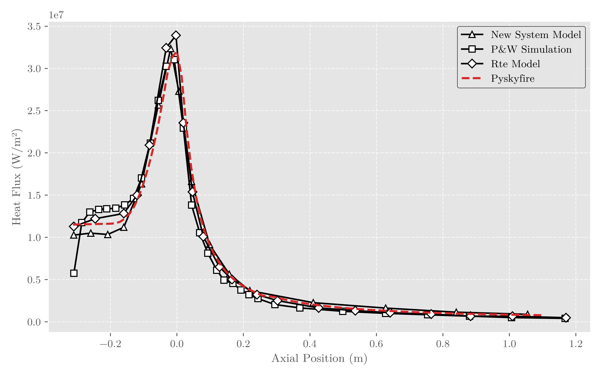

# pyskyfire
Pyskyfire is a simulation framework for regeneratively cooled, liquid propellant rocket engines

The current version is in need of a bit of a brush-up to become usable for as many people as possible. In the meantime, enjoy some of the outputs the library is able to create!

A lot of the reference data is against Binder et al. (1997)

