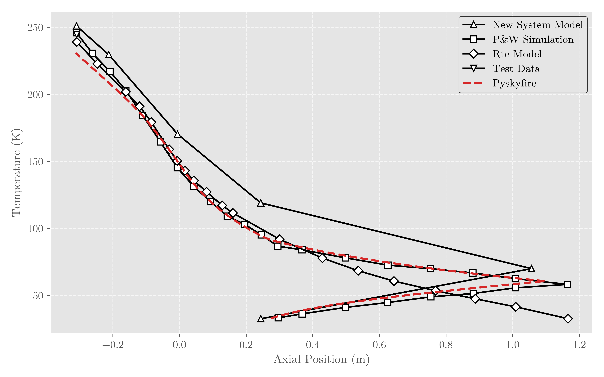
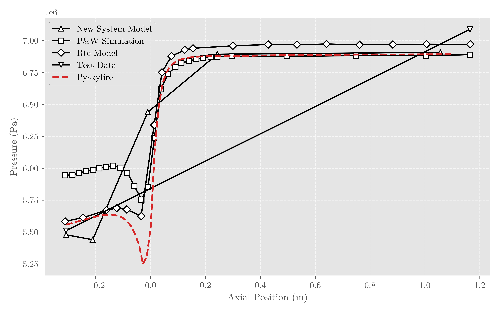
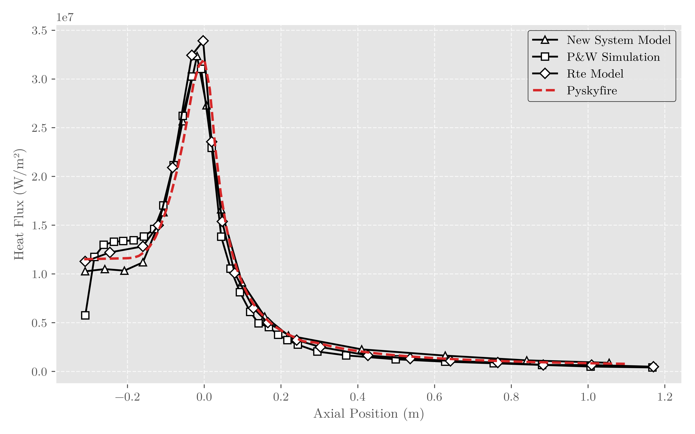
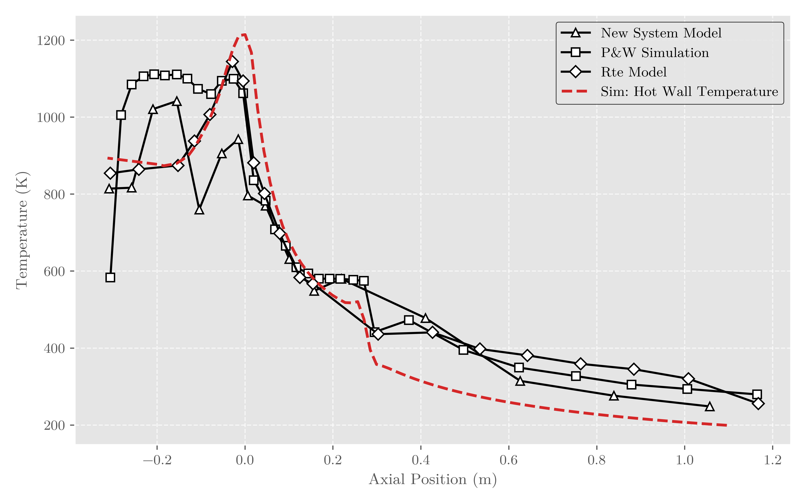
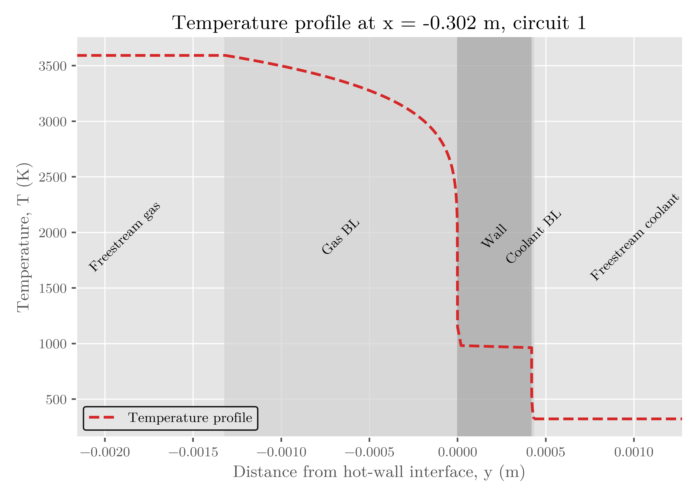
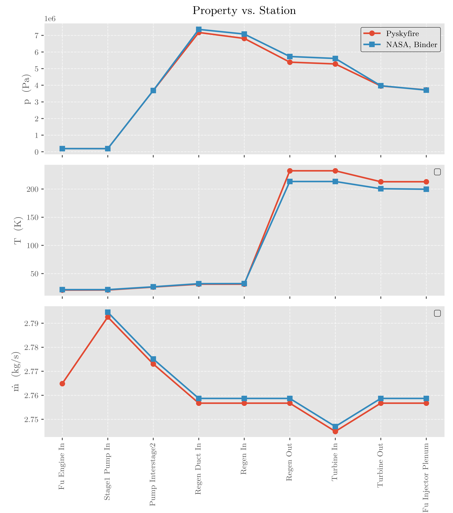

# Capabilities

This page shows what Pyskyfire can do at-a-glance. The goal of this page is to give you an overview of the current capabilities of the package, so that you can better understand if it fits your needs. 

## Generate thrust chamber and nozzle geometry
* Sizes the throat and nozzle from propulsion inputs such as:
  * propellant combination
  * fuel and oxidizer inlet state
  * chamber pressure
  * mixture ratio
  * thrust
  * exit pressure or expansion target
  * ambient pressure
  * characteristic chamber length, $L^*$
* Generate **chamber geometry** from chamber volume, contraction ratio, converging angle, throat radius, and chamber/nozzle blend radii.
* Generate **bell nozzles** using a Rao-style thrust-optimized parabolic contour.
* Generate **conical nozzles** for simpler comparison cases.

```{raw} html
<div class="psf-demo-frame psf-plot-demo">
  <iframe
    src="../_static/demos/methane_engine_contour.html"
    title="Interactive methane engine contour plot"
    loading="lazy"
    sandbox="allow-scripts allow-same-origin">
  </iframe>
</div>
``` 

## Estimate hot-gas and nozzle performance

* Solve chemical-equilibrium-based thrust chamber performance using NASA CEA as a backend.
* Estimate useful propulsion parameters such as:
  * vacuum and/or ambient specific impulse
  * characteristic velocity, $c^*$
  * thrust coefficient, $C_F$
  * total mass flow rate
  * oxidizer and fuel mass flow rate
  * throat radius and throat area
  * expansion ratio
  * chamber volume from $L^*$

* Generate hot-gas property distributions **throughout the chamber and nozzle**, including quantities such as:
  * pressure
  * temperature
  * Mach number
  * molecular mass
  * ratio of specific heats
  * enthalpy
  * specific heat
  * thermal conductivity
  * viscosity
  * Prandtl number
  * density
  * speed of sound

```{raw} html
<div class="psf-demo-frame psf-plot-demo">
  <iframe
    src="../_static/demos/rl10_viscosity_field.html"
    title="RL10 Conductivity Field"
    loading="lazy"
    sandbox="allow-scripts allow-same-origin">
  </iframe>
</div>
``` 

## Solve regenerative cooling problems

* Solve regenerative cooling along user-defined cooling circuits.
* Support multiple cooling passes over different parts of the thrust chamber.
* Support co-current and counter-current coolant flow.
* Support different coolants in different cooling circuits.
* Uses fluid property models for a wide range of liquid and gaseous coolants.
* Model coolant pressure drop, temperature rise, velocity, heat flux, and wall temperatures along the engine.
* Define cooling circuits over arbitrary axial spans of the thrust chamber.
* Support complex cooling channel layouts, including:
  * straight channels
  * slanted or helical channels
  * interleaved channel circuits
  * circuits with different channel counts
  * circuits covering different chamber/nozzle regions
* Support multiple cooling-channel cross-section models.
* Support variable channel height, width, roughness, and hydraulic geometry along the engine.
* Support multi-material chamber walls, enabling studies of:
  * layered wall temperature drops
  * thermal barrier coatings
* Estimate temperature profile from hot gas through boundary layer, multi material-walls, and coolant boundary layer. 








## Model film cooling

* Solve film cooling cases for sub-critical pressure conditions.
* Model coolant injection, entrainment, and film-cooling heat-transfer effects using implemented film-cooling correlations.
* Use film-cooling calculations as a separate analysis path or as a basis for future coupling to regenerative cooling models.

## Solve full engine-cycle networks

* Represent an engine as a network of connected thermodynamic stations, signal variables, and component blocks.
* Solve expander-cycle-style engine architectures containing:

  * pumps
  * turbines
  * regenerative cooling passages
  * ducts
  * valves
  * injectors
  * mass-flow splitters
  * mass-flow mergers
  * recirculation paths
* Solve coupled pump, turbine, pressure-loss, coolant-heating, and thrust-chamber constraints.
* Track pressure, temperature, mass flow, and thermodynamic state through the engine.
* Represent both fuel-side and oxidizer-side flow paths.
* Use the engine-network formulation to investigate different expander-cycle layouts and pressure budgets.




## Analyze pumps and turbomachinery

* Provide pump and turbine utility models for engine-cycle calculations.
* Estimate pump power, turbine power, pressure rise, pressure drop, and efficiency effects.
* Support first-order sizing and analysis of rotating machinery components used in liquid rocket engine cycles.
* Include pump-related geometry and visualization utilities for early-stage turbopump design work.

## Generate plots and reports

* Generate built-in plots for common engine analysis outputs, including:

  * thrust chamber contour
  * coolant pressure
  * coolant temperature
  * coolant velocity
  * wall temperature
  * heat flux
  * coolant flow area
  * hot-gas transport properties
  * engine-network diagrams
  * pressure-temperature diagrams
* Generate standalone HTML reports containing tables, plots, images, and embedded interactive content.
* Save and reload analysis results for post-processing.

## Visualize cooling-channel geometry in 3D

* Generate 3D visualizations of thrust chamber cooling-channel geometry.
* Render cooling channels with their actual centerline placement and cross-section geometry.
* Visualize interleaved and multi-pass cooling layouts.
* Export an interactive browser-based 3D viewer for documentation or report generation.
* Embed a rotatable 3D engine model directly into generated HTML documentation.

```{raw} html
<div class="psf-demo-frame">
  <iframe
    src="../_static/demos/engine_3d.html"
    title="Interactive 3D engine model"
    loading="lazy"
    sandbox="allow-scripts allow-same-origin">
  </iframe>
</div>
``` 

## Support scripted design studies

* Use Python scripts to define complete engine cases, run analyses, and post-process results.
* Modify geometry, materials, coolant circuits, propellants, pressures, mixture ratio, thrust level, and cycle parameters programmatically.
* Use examples and validation cases as templates for new thrust chamber and engine-cycle studies.


